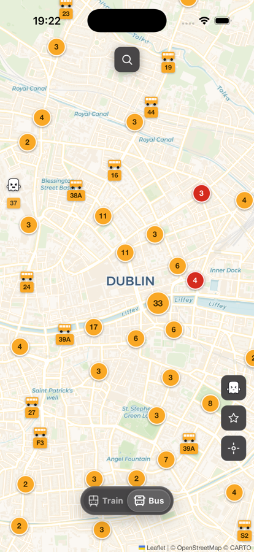

# Púca

Real-time bus and train tracker for Ireland — a shapeshifting spirit of Irish folklore watching vehicles flit across the island in real time.

Live at [puca.dev](https://puca.dev).

<p align="center">
  
  
</p>

<p align="center">
  
</p>

Púca is a vehicle-centric PWA for Irish public transport. It shows live positions for Dublin Bus, Bus Éireann, Go-Ahead, and Irish Rail trains on a map, with stop and arrival context for the moment you are already waiting nearby.

It is not a journey planner, ticketing product, or transport marketplace. The core question is simple:

> Where is my bus or train right now?

## Features

- Live bus positions from NTA GTFS-Realtime feeds.
- Live train positions and station movement data from Irish Rail.
- Route filtering, stop search, stop arrivals, and focused bus tracking.
- Train station-to-station search with focused train tracking where live position data exists.
- Favorites for bus routes, bus stops, and train searches.
- Offline/PWA shell with English and Chinese UI.

## How it works

NTA GTFS static feeds are processed offline by Python scripts into route geometry
JSON and SQLite schedule databases. The Bun server then polls NTA GTFS-Realtime
(Vehicles, TripUpdates) and Irish Rail every 30 seconds, warming an in-memory
cache of live vehicle positions and arrival predictions.

The browser fetches this cache and renders bus and train markers on a Leaflet map,
computing route projections and stop arrival estimates client-side from the
pre-generated GTFS schedule data.

## Stack

- **Runtime**: Bun with `Bun.serve()`
- **Frontend**: Preact + TypeScript
- **Map**: Leaflet + `leaflet.markercluster`
- **Data**: NTA/TFI GTFS, GTFS-Realtime, and Irish Rail APIs
- **Hosting**: Fly.io

## Develop

Prerequisites:

- Bun 1.3 or newer.
- Python 3 for GTFS data-generation scripts.
- An NTA API key from [developer.nationaltransport.ie](https://developer.nationaltransport.ie/).

Install dependencies:

```bash
bun install
```

Create a local environment file:

```bash
cp .env.example .env
```

Then set `NTA_API_KEY` in `.env`.

Run locally:

```bash
bun run dev
```

Open [http://localhost:3000](http://localhost:3000).

Useful checks:

```bash
bun run typecheck
bun run lint
bun test
```

Build:

```bash
bun run build
```

## Data

Schedule data is generated from GTFS static feeds (stored in `gtfs/`, gitignored).

| Command | What it does |
|---------|-------------|
| `bun run db:check` | Download the latest NTA GTFS zip and validate feed versions |
| `bun run db:generate` | Build SQLite schedule DBs from GTFS for all operators |
| `bun run json:generate` | Generate route geometry and stop lookup JSON for the frontend |

Generated files land in `src/data/` — JSON is committed to the repo, SQLite DBs
are gitignored and stored on a Fly volume at `/data` in production.

Operational notes live in [docs/](docs/). Project maintenance context lives in [PROJECT_NOTES.md](PROJECT_NOTES.md).

## Contributions

Púca is maintained as a personal open-source project. External pull requests are not accepted at this time, but issues and bug reports are welcome.

## Security

See [SECURITY.md](SECURITY.md) for how to report vulnerabilities.

## License

Púca is licensed under the GNU Affero General Public License v3.0 only.
See [LICENSE](LICENSE).
